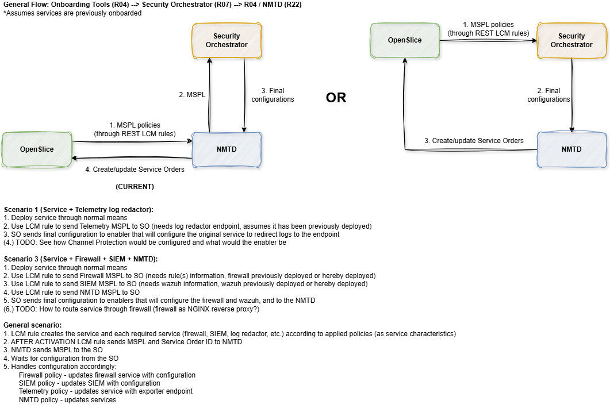

# RIGOUROUS OSL-SO Orchestrator



# Installation

## Prerequisites
- [Docker](https://docs.docker.com/get-docker/)
- Reachable [OpenSlice](https://osl.etsi.org/)
- Reachable UMU Security Orchestrator

## Steps
1. Build the project
```sh
docker build -t nmtd .
```

2. Run the project
```sh
docker run -e OPENSLICE_HOST=<YOUR_OPENSLICE_HOST_AND_PORT> -e SO_HOST=<YOUR_SECURITY_ORCHESTRATOR_HOST_AND_PORT> -e LOG_LEVEL=<LOG_LEVEL> nmtd
```

# OpenSlice Service Characteristics

## NMTD and Mutation characteristics

The NMTD component affects services with characteristics prefixed by `Mutation::` and mutates the value of the characteristic whose name follows that prefix, e.g. `Mutation::Port` would define the necessary information to rotate the `Port` characteristic. The former characteristic would follow the format:

```json
{
    "name": "Mutation::Port",
    "serviceSpecCharacteristicValue": [
    {
        "value": {
            "value": "min", // min, max, random, inactive
            "alias": "interval"
        },
        "value": {
            "value": "0",
            "alias": "valueFrom"
        },
        "value": {
            "value": "60",
            "alias": "valueTo"
        },
        "value": {
            "value": "[80, 8080, 10000-11000]",
            "alias": ""
        }
    }
    ]
}
```

While the latter could look like:

```json
{
    "name": "Port",
    "serviceSpecCharacteristicValue": [
    {
        "value": {
            "value": "80",
            "alias": ""        
        }
    }
    ]
}
```

OpenSlice LCM Supervision rules would be used to update the underlying network services when these characteristics are updated (as is already done with Helm-based services in OpenSlice).

## Risk Specification characteristics

For services to have their risk specification updated, there needs to be a characteristic named `CPE` containing the Common Platform Enumeration of the base application. Then, by using the `/risk` endpoint, the `Privacy score` and `Risk score` characteristics of services matching the provided CPE will be updated.

**Risk Specification:**

```json
{
    "cpe": "cpe:2.3:a:free5gc:free5gc:3.2.1:*:*:*:*:*:*:*",
    "privacy_score": 7.8,
    "risk_score": 4.4
}
```

## UMU Security Orchestrator integration (WIP)

Requires OpenSlice "After Activation" LCM rules to send the MSPL policies to the `/osl/<service_order_id>` endpoint of this component, where `<service_order_id>` is the ID of the Service Order. The Security Orchestrator would then translate the MSPL policies into final configurations for OpenSlice Catalog services (envisioned policies to be supported are Firewall, SIEM, Telemetry, and Channel Protection MSPL).
